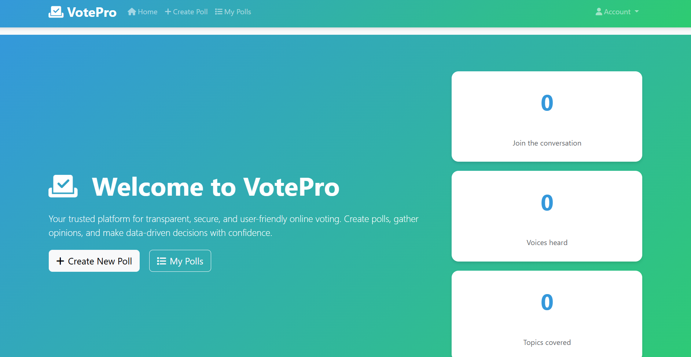
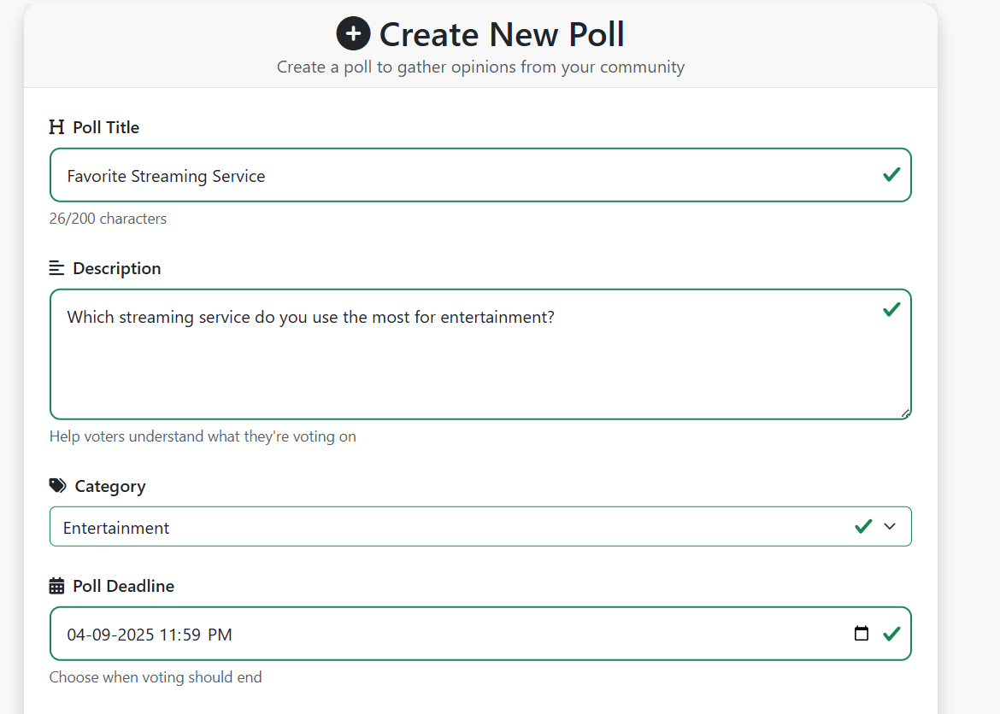
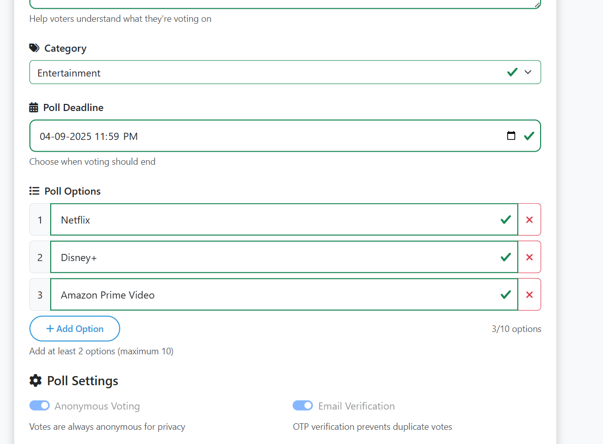
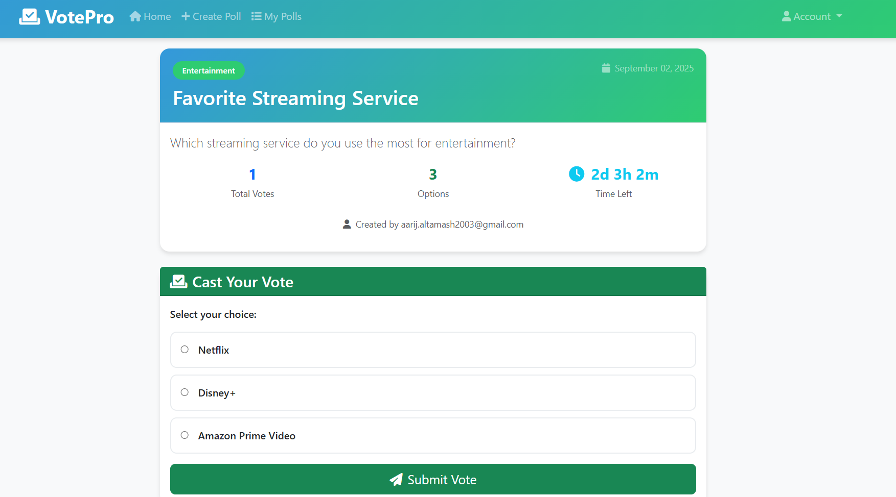
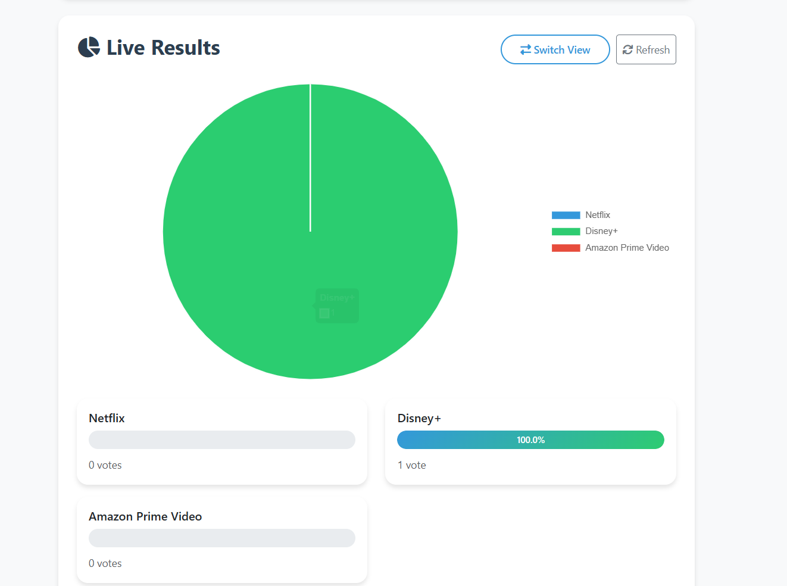
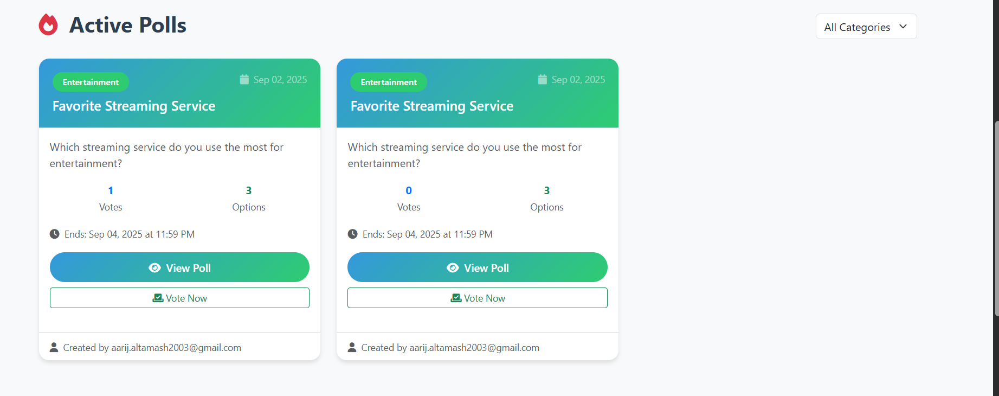
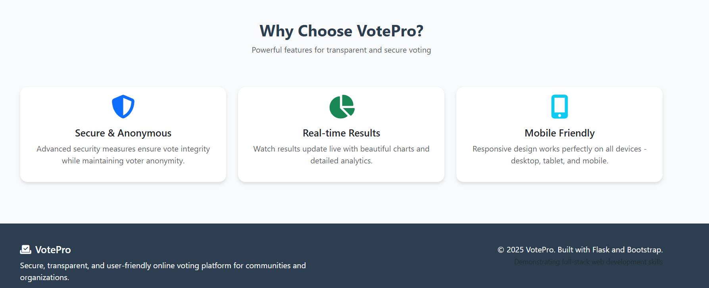
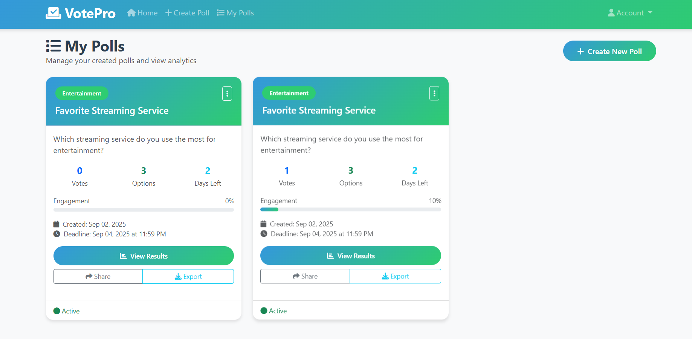

# 🗳️ VotePro - Advanced Polling Application

<div align="center">


**A modern, secure Flask-based polling application with seamless voting and real-time results**

[](https://votepro.onrender.com)
[](https://github.com/altamash-faraz/votepro)

[](https://python.org)
[](https://flask.palletsprojects.com/)
[](https://postgresql.org)
[](LICENSE)

</div>

---

## 🌟 **Live Application**

### 🌐 **Access VotePro:**

- **🌍 Live Website:** [https://votepro.onrender.com](https://votepro.onrender.com)
- **📱 Mobile Responsive:** Fully optimized for all devices
- **🔒 HTTPS Secured:** SSL encryption enabled

### 🎮 **Demo Features:**

Try the application with these features:

- Create polls with multiple options
- Instant voting for registered users (no OTP required)
- Email verification for new accounts
- Real-time poll results and analytics
- User profile and voting history
- Poll management (activate/deactivate/delete)

---

## 📸 **Screenshots**

### 🏠 Homepage & Dashboard



*Beautiful, modern interface with active polls and statistics - featuring the welcome page with gradient design and call-to-action buttons*

### 📊 Poll Creation Interface



*Intuitive poll creation form with multiple options, categories, and deadline settings*

### 🗳️ Voting Interface



*Seamless one-click voting system with real-time updates and clean option selection*

### 📊 Poll Results & Analytics



*Interactive charts and detailed voting analytics with real-time percentage calculations*

### 📧 Email Verification



*Secure email verification for account registration with user-friendly interface*

### 🎛️ User Dashboard



*Comprehensive poll management dashboard showing user's created polls and analytics*

### 🔐 Login & Registration



*Clean and secure login/registration interface with email verification*

### 📱 Mobile Responsive



*Fully responsive design optimized for mobile devices and tablets*

---

## ✨ **Key Features**

### 🔐 **Security & Authentication**

- ✅ **Email Verification** - Secure account registration with email verification
- ✅ **Instant Voting** - One-click voting for registered users with duplicate prevention
- ✅ **User Profile** - Personal dashboard with voting history and statistics
- ✅ **Session Management** - Secure user sessions with Flask-Bcrypt
- ✅ **CSRF Protection** - Built-in security measures

### 🗳️ **Polling Features**

- ✅ **Create Unlimited Polls** - Multiple choice questions with custom options
- ✅ **Real-time Results** - Live vote counting and percentage display
- ✅ **Poll Management** - Activate/deactivate polls, set deadlines
- ✅ **Category System** - Organize polls by topics and categories

### 📊 **Analytics & Insights**

- ✅ **Engagement Metrics** - Track voter participation and poll popularity
- ✅ **Visual Charts** - Interactive progress bars and statistics
- ✅ **Vote Analytics** - Detailed breakdown of voting patterns
- ✅ **Dashboard** - Comprehensive overview of all your polls

### 📱 **User Experience**

- ✅ **Responsive Design** - Perfect on desktop, tablet, and mobile
- ✅ **Modern UI/UX** - Clean, intuitive interface with Bootstrap 5
- ✅ **Real-time Updates** - Dynamic content loading and updates
- ✅ **Email Notifications** - Automatic email alerts and confirmations

---

## 🛠️ **Technology Stack**

### **Backend**

- **🐍 Python 3.8+** - Core programming language
- **🌶️ Flask 3.0** - Lightweight web framework
- **🗄️ SQLAlchemy** - Database ORM with PostgreSQL
- **🔐 Flask-Bcrypt** - Password hashing and security
- **📧 Flask-Mail** - Email functionality for account verification

### **Frontend**

- **🎨 Bootstrap 5** - Responsive CSS framework
- **⚡ JavaScript ES6+** - Interactive frontend functionality
- **🎭 Jinja2** - Server-side templating engine
- **📱 Responsive Design** - Mobile-first approach

### **Deployment & DevOps**

- **☁️ Render.com** - Cloud hosting platform
- **🐘 PostgreSQL** - Production database
- **🔧 Gunicorn** - WSGI HTTP server
- **🚀 GitHub Actions** - Continuous deployment

---

## 🚀 **Quick Start**

### **1. 🌐 Try Live Demo**

Visit [https://votepro.onrender.com](https://votepro.onrender.com) and start exploring immediately!

### **2. 🔧 Local Development**

```bash
# Clone the repository
git clone https://github.com/altamash-faraz/votepro.git
cd votepro

# Create virtual environment
python -m venv .venv
source .venv/bin/activate  # On Windows: .venv\Scripts\activate

# Install dependencies
pip install -r requirements.txt

# Set up environment variables
cp .env.example .env
# Edit .env with your email credentials

# Run the application
python app.py
```

### **3. 📧 Email Configuration**

For full functionality, configure Gmail SMTP:

1. Enable 2FA on your Google account
2. Generate an App Password
3. Update `.env` with your credentials

---

## 📁 **Project Structure**

```text
votepro/
├── 📁 templates/          # HTML templates
│   ├── base.html         # Base layout
│   ├── index.html        # Homepage
│   ├── create_poll.html  # Poll creation
│   ├── view_poll.html    # Poll viewing & voting
│   └── my_polls.html     # User dashboard
├── 📄 app.py             # Main Flask application
├── 📄 requirements.txt   # Python dependencies
├── 📄 Procfile          # Render deployment config
├── 📄 .env              # Environment variables
└── 📁 instance/         # Database files (local)
```

---

## 🌟 **Features Showcase**

### **📈 Real-time Analytics**

- Live vote counting with percentage breakdowns
- Engagement metrics and participation rates
- Beautiful progress bars and visual indicators

### **🔒 Advanced Security**

- Email verification for secure account creation
- Secure session management
- SQL injection protection
- CSRF token validation

### **📱 Mobile Experience**

- Fully responsive design for all screen sizes
- Touch-friendly voting interface
- Optimized loading times
- Progressive Web App capabilities

---

## 🔮 **Future Enhancements**

- [ ] **🔄 Real-time Updates** - WebSocket integration for live results
- [ ] **📊 Advanced Analytics** - Detailed voting insights and trends
- [ ] **🌍 Multi-language Support** - Internationalization
- [ ] **📱 Mobile App** - Native Android/iOS applications
- [ ] **🔗 Social Integration** - Share polls on social media
- [ ] **🎨 Custom Themes** - Personalized poll appearance
- [ ] **📈 Export Features** - Download results as PDF/Excel

---

## 👨‍💻 **Developer**

<div align="center">

**Developed with ❤️ by [Altamash Faraz](https://github.com/altamash-faraz)**

[](https://github.com/altamash-faraz)
[](https://linkedin.com/in/altamash-faraz)

</div>

---

## 📜 **License**

This project is licensed under the MIT License - see the [LICENSE](LICENSE) file for details.

---

## 🤝 **Contributing**

Contributions, issues, and feature requests are welcome! Feel free to check the [issues page](https://github.com/altamash-faraz/votepro/issues).

1. **Fork the Project**
2. **Create your Feature Branch** (`git checkout -b feature/AmazingFeature`)
3. **Commit your Changes** (`git commit -m 'Add some AmazingFeature'`)
4. **Push to the Branch** (`git push origin feature/AmazingFeature`)
5. **Open a Pull Request**

---

## ⭐ **Show your support**

Give a ⭐️ if this project helped you!

---

<div align="center">

**🚀 [Try VotePro Live](https://votepro.onrender.com) | 📂 [View Source Code](https://github.com/altamash-faraz/votepro)**

_Built with modern web technologies for secure, scalable polling solutions_

</div>
